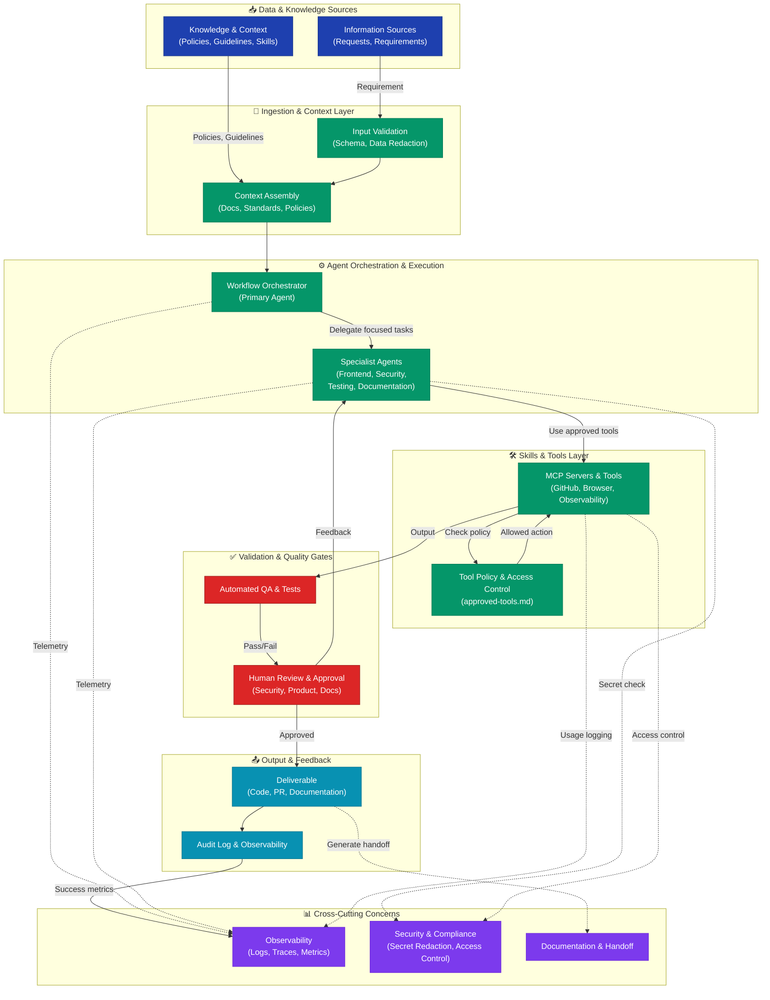

# System Architecture: Banco Vecinal Agent Ecosystem

This document defines the clean, production-ready architecture for the Banco Vecinal demonstration project. It replaces informal workflow diagrams with a layered, governance-first design that aligns with Copilot agent best practices and MCP policy enforcement.

---

## Architecture Overview

The system is organized into **six logical layers**, each with clear responsibilities, interfaces, and control mechanisms.



---

## Layer Details

### 1. 📥 Data & Knowledge Sources

**Purpose:** Define what drives the system and what knowledge the agents need.

| Component | Description | Source |
|-----------|-------------|--------|
| **Information Sources** | Requests, requirements, user input, external events | Product team, stakeholders, support tickets |
| **Knowledge & Context** | Domain policies, development guidelines, approved skills, MCP allowlists | `.github/copilot-instructions.md`, `.github/instructions/`, `.github/skills/`, `mcp/` directory |

**Key Responsibility:**
- All information entering the system must be sourced from trusted, documented locations.
- Policies and guidelines must be version-controlled and reviewed.

---

### 2. 🔄 Ingestion & Context Layer

**Purpose:** Prepare and validate all incoming information before agents act on it.

| Component | Description | Implementation |
|-----------|-------------|-----------------|
| **Input Validation** | Schema validation, format checks, sensitive data redaction | Agents must redact API keys, secrets, and PII before context |
| **Context Assembly** | Gather all relevant documentation, standards, and policies | Load `.github/instructions/` and `.github/skills/` for the task domain |

**Key Responsibility:**
- Never pass raw, unvalidated input to agents.
- Redact all sensitive data before it reaches orchestration.
- Fail fast if input is malformed or dangerous.

**Example Gate:**
```
IF input contains secrets → REDACT
IF input violates schema → REJECT
IF input is ambiguous → REQUEST CLARIFICATION
ELSE → assemble context and proceed
```

---

### 3. ⚙️ Agent Orchestration & Execution

**Purpose:** Coordinate work between a primary orchestrator and specialized agents.

| Component | Description | Responsibility |
|-----------|-------------|-----------------|
| **Workflow Orchestrator** | Primary agent that triages requests, plans execution, delegates tasks | Read `docs/agent-ecosystem.md` for delegation patterns |
| **Specialist Agents** | Focused agents for frontend, security review, testing, documentation | See `.github/agents/` for agent profiles |

**Specialist Roles:**
- `frontend-specialist` → UI/UX, accessibility, React best practices.
- `security-reviewer` → Secret handling, permission checks, risk assessment.
- `test-specialist` → Test strategy, testability, validation.
- `documentation-specialist` → Clear docs, API contracts, handoff wording.

**Key Responsibility:**
- Clearly delegate based on task boundaries, not agent convenience.
- Each specialist should work in isolation; minimal cross-specialist communication.
- Orchestrator tracks progress and gathers outputs for assembly.

---

### 4. 🛠️ Skills & Tools Layer

**Purpose:** Enforce least-privilege access to external capabilities via approved MCP servers.

| Component | Description | Policy Document |
|-----------|-------------|-----------------|
| **MCP Servers** | Approved integrations (GitHub, Browser, Observability) | `mcp/catalog/` |
| **Allowed Tools** | Explicit allowlist per server; prefer read-only | `mcp/policies/approved-tools.md` |
| **Access Control** | Authentication, secret management, approval gates | Defined in catalog entries |

**Approval Gates by Operation Type:**
| Operation | Approval Required |
|-----------|-----------------|
| Read, list, search | None (assumed safe) |
| Create, update (non-production) | Optional (review if risky) |
| Delete, destroy | **Human approval required** |
| Write to production | **Human approval required** |
| External communication (email, Slack) | **Human approval required** |
| Secret/credential handling | **Security reviewer approval** |

**Key Responsibility:**
- Always check `mcp/policies/approved-tools.md` before executing an action.
- Never use tools outside the catalog.
- Default to read-only; require justification for write operations.
- Redact secrets before logging; use environment variables or managed secrets only.

---

### 5. ✅ Validation & Quality Gates

**Purpose:** Ensure all deliverables meet quality, security, and compliance standards before release.

| Stage | Responsibility | Decision |
|-------|-----------------|----------|
| **Automated QA** | Run test suite, lint, type checks, security scans | Pass/fail deterministically |
| **Human Review** | Security reviewer, product owner, documentation reviewer | Approve or request changes |
| **Approval Decision** | Final gate before merge/delivery | Yes/no, with feedback |

**Feedback Loop:**
- If QA fails → specialist fixes code.
- If human review rejects → specialist revises and resubmits.
- Repeat until approved.

**Key Responsibility:**
- No deliverable leaves the system without passing both automated and human gates.
- Review must explicitly check:
  - No secrets in code or logs.
  - No dangerous operations without approval.
  - Documentation is clear and complete.

---

### 6. 📤 Output & Feedback

**Purpose:** Release approved deliverables and capture success metrics.

| Component | Description | Output |
|-----------|-------------|--------|
| **Deliverable** | Merged code, pull request, documentation, deployment artifacts | GitHub PR, merged branch, published docs |
| **Audit Log** | Record of all decisions, approvals, and tool usage | Commit messages, PR comments, observability traces |

**Key Responsibility:**
- Every merge must include a clear, complete audit trail.
- Success metrics feed back to observability.
- Handoff documentation must be generated automatically (or templated).

---

## 📊 Cross-Cutting Concerns

These services apply **across all layers** and are not part of any single layer.

### Observability
- **What:** Logs, distributed traces, metrics, event streams.
- **Applied At:** Every orchestration step, tool execution, approval decision.
- **Examples:**
  - "Agent X started task Y at 2026-09-02T10:00:00Z"
  - "MCP tool 'GitHub API' executed 'create PR' with result: success"
  - "Human reviewer rejected PR due to: missing test coverage"

### Security & Compliance
- **What:** Secret detection, redaction, access control, audit.
- **Applied At:** Ingestion (redact inputs), orchestration (log tool usage), quality gates (security review).
- **Examples:**
  - Redact AWS keys before they reach agent context.
  - Log all destructive operations.
  - Require security reviewer approval for permission changes.

### Documentation & Handoff
- **What:** Generated summaries, API contracts, deployment notes, team communication.
- **Applied At:** Quality gates (draft docs), output stage (finalize and publish).
- **Examples:**
  - Auto-generate PR summary from commits and approvals.
  - Document all MCP tools used in the deliverable.
  - Create a handoff checklist for the next team.

---

## 🔄 Workflow Example: New Feature Request

**Scenario:** Product team requests a new "Community Support" page for Banco Vecinal.

```
1. [SOURCES]
   - Requirement: "Add Community Support page with contact form and FAQs"
   - Load context from .github/instructions/react-webapp.instructions.md

2. [INGESTION]
   - Validate requirement: is it clear? → YES
   - No secrets to redact → OK
   - Assemble context: React style guide, MCP allowlist, approval gates

3. [ORCHESTRATION]
   - Orchestrator triages: "This is a scoped frontend task"
   - Delegates to frontend-specialist: "Implement UI components"
   - Delegates to test-specialist: "Plan test strategy"
   - Delegates to security-reviewer: "Check for form security"

4. [SKILLS & TOOLS]
   - frontend-specialist uses: GitHub (read PR template, create branch)
   - test-specialist uses: GitHub (read test setup, run tests)
   - security-reviewer uses: GitHub (review code, MCP policy check)
   - All tools are in mcp/catalog/ → ALLOWED

5. [QUALITY GATES]
   - Automated QA: Tests pass, linting passes → ✅
   - Security review: "Form validates input, no SQL injection risk" → ✅
   - Documentation review: "README updated with new page details" → ✅

6. [OUTPUT]
   - Result: PR merged to main, new page live
   - Audit: PR #42 approved by 3 reviewers, all checks passed
   - Observability: Deployment metrics recorded
   - Handoff: Product team notified via auto-generated summary
```

---

## 🎯 Mapping to Repository Structure

| Directory | Layer | Purpose |
|-----------|-------|---------|
| `.github/copilot-instructions.md` | Sources | Repository-wide development standards |
| `.github/instructions/` | Ingestion | Path-specific guidance (e.g., React webapp) |
| `.github/skills/` | Ingestion | Reusable skill templates (e.g., simple React webapp) |
| `.github/agents/` | Orchestration | Custom specialist agent profiles |
| `mcp/catalog/` | Skills & Tools | Approved MCP servers and versions |
| `mcp/policies/` | Skills & Tools | Tool allowlists, approval rules, secret handling |
| `docs/agent-ecosystem.md` | Orchestration | Delegation patterns, agent responsibilities |
| `workshop/exercises/` | All Layers | Practical examples of the full workflow |

---

## 🛡️ Security & Governance Checklist

Before any agent-driven pull request is merged:

- [ ] **No secrets committed.** (API keys, tokens, passwords redacted or in environment variables)
- [ ] **MCP tools used are in the approved catalog.** (`mcp/catalog/`)
- [ ] **Dangerous operations have human approval.** (Destructive, production, external comms)
- [ ] **Audit trail is complete.** (PR comments, commit messages, tool usage logged)
- [ ] **Tests pass, linting passes, security checks pass.**
- [ ] **Documentation is complete and clear.** (README, API contracts, handoff notes)
- [ ] **Feedback loops are tracked.** (If a gate failed, show how it was fixed)

---

## 📚 Additional Reading

- **Agent Ecosystem:** [`docs/agent-ecosystem.md`](./agent-ecosystem.md)
- **MCP Governance:** [`mcp/README.md`](../mcp/README.md)
- **Approved Tools Policy:** [`mcp/policies/approved-tools.md`](../mcp/policies/approved-tools.md)
- **Workshop:** [`workshop/README.md`](../workshop/README.md)
- **Copilot Instructions:** [`.github/copilot-instructions.md`](../.github/copilot-instructions.md)

---

## Version History

| Date | Author | Change |
|------|--------|--------|
| 2026-09-02 | Copilot | Initial architecture document and diagrams |

