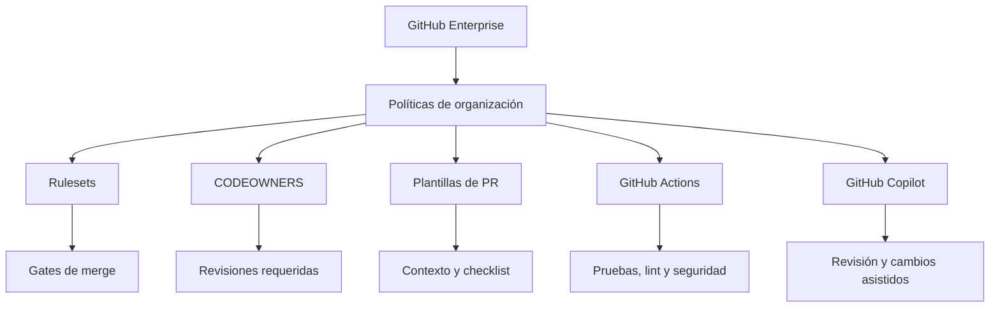
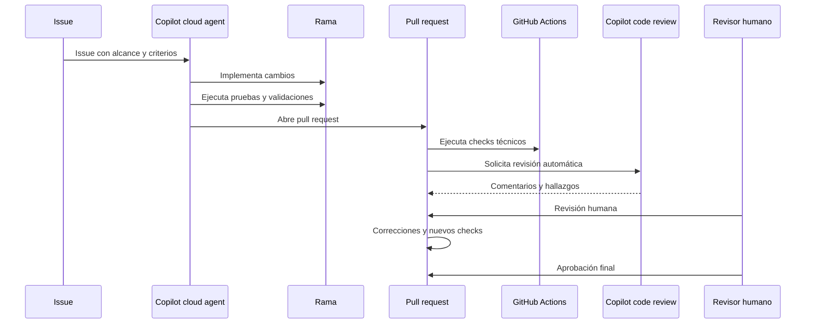

# GitHub Enterprise: reglas avanzadas y pull requests automatizados con Copilot

> **Objetivo:** establecer controles técnicos consistentes y automatizar la creación, revisión y validación de pull requests usando GitHub Enterprise, GitHub Actions y GitHub Copilot.

---

## 1. Agenda

1. Gobierno técnico con GitHub Enterprise
2. Reglas avanzadas para repositorios
3. Estandarización de pull requests
4. Automatización con GitHub Copilot
5. Gates de calidad y seguridad
6. Métricas y mejora continua
7. Flujo operativo recomendado

---

## 2. El desafío

Los equipos necesitan:

- Proteger ramas críticas y código sensible.
- Aplicar las mismas reglas en múltiples repositorios.
- Reducir pull requests incompletos o difíciles de revisar.
- Automatizar validaciones repetitivas.
- Aumentar la velocidad sin reducir la calidad técnica.
- Mantener trazabilidad de cambios generados o asistidos por IA.

> La automatización debe optimizar resultados técnicos —corrección, seguridad, confiabilidad y mantenibilidad—, no únicamente el volumen de código producido.

---

## 3. Modelo de gobierno técnico



Las reglas deben aplicarse en capas:

1. **Empresa:** estándares mínimos y controles obligatorios.
2. **Organización:** políticas comunes para equipos y dominios.
3. **Repositorio:** configuración específica del producto.
4. **Pull request:** validaciones, revisiones y evidencia técnica.

---

## 4. Rulesets: controles avanzados

Los rulesets permiten aplicar políticas sobre ramas y etiquetas, incluyendo revisiones, checks obligatorios y controles de merge.

Fuente: [About rulesets](https://docs.github.com/en/enterprise-cloud@latest/repositories/configuring-branches-and-merges-in-your-repository/managing-rulesets/about-rulesets)

### Reglas recomendadas para `main`

- Requerir pull request antes del merge.
- Requerir al menos dos revisiones aprobatorias en código crítico.
- Requerir aprobación de CODEOWNERS.
- Requerir todos los status checks obligatorios.
- Requerir conversación resuelta.
- Bloquear force-push y eliminación de la rama.
- Requerir commits firmados cuando corresponda.
- Limitar los actores con permisos de bypass.
- Aplicar reglas de actualización estricta de la rama.
- Registrar excepciones y revisarlas periódicamente.

---

## 5. Reglas de organización y empresa

Para repositorios bajo un mismo estándar:

- Crear rulesets a nivel empresarial.
- Aplicar reglas a organizaciones o repositorios seleccionados.
- Comenzar con un piloto en repositorios representativos.
- Usar modo de evaluación antes de aplicar bloqueos.
- Medir falsos positivos y tiempos de revisión.
- Centralizar reglas comunes y permitir excepciones justificadas.

### Controles adicionales

- Bloquear archivos sensibles o no permitidos.
- Limitar extensiones de archivo.
- Restringir tamaños máximos.
- Evitar rutas excesivamente largas.
- Proteger redes completas de forks mediante push rulesets.

Fuente: [Managing and standardizing pull requests](https://docs.github.com/en/enterprise-cloud@latest/pull-requests/reference/managing-and-standardizing-pull-requests)

---

## 6. CODEOWNERS y responsabilidad técnica

CODEOWNERS permite solicitar automáticamente revisiones a los equipos responsables de determinados archivos o directorios.

### Ejemplo

```text
# CODEOWNERS

/.github/                         @platform-team
/src/security/                    @security-team
/src/payments/                    @payments-team
/docs/                            @technical-writers
```

### Recomendaciones

- Asignar propietarios para seguridad, infraestructura y librerías compartidas.
- Evitar equipos demasiado grandes.
- Mantener los propietarios actualizados.
- Combinar CODEOWNERS con reglas de aprobación obligatoria.
- Validar que los propietarios tengan acceso suficiente al repositorio.

Fuente: [About code owners](https://docs.github.com/en/enterprise-cloud@latest/repositories/managing-your-repositorys-settings-and-features/customizing-your-repository/about-code-owners)

---

## 7. Plantilla de pull request

Una plantilla reduce la variabilidad y obliga a proporcionar evidencia técnica.

```markdown
## Descripción

<!-- Explica el problema y la solución propuesta. -->

## Tipo de cambio

- [ ] Nueva funcionalidad
- [ ] Corrección de defecto
- [ ] Refactorización
- [ ] Seguridad
- [ ] Documentación
- [ ] Configuración o infraestructura

## Validación

- [ ] Pruebas unitarias agregadas o actualizadas
- [ ] Pruebas de integración ejecutadas
- [ ] Lint y formateo ejecutados
- [ ] Validación de seguridad ejecutada
- [ ] Documentación actualizada

## Riesgos y rollback

- Riesgos conocidos:
- Plan de rollback:

## Checklist

- [ ] No se incluyen secretos ni cadenas de conexión
- [ ] Se respetan las convenciones del repositorio
- [ ] Se actualizaron los propietarios o documentación afectados
- [ ] El cambio es pequeño y está acotado
```

Fuente: [Creating a pull request template](https://docs.github.com/en/enterprise-cloud@latest/communities/using-templates-to-encourage-useful-issues-and-pull-requests/creating-a-pull-request-template-for-your-repository)

---

## 8. Instrucciones del repositorio para Copilot

Agregar `.github/copilot-instructions.md` para describir:

- Estructura del repositorio.
- Comandos de build y pruebas.
- Convenciones de código.
- Reglas de seguridad.
- Archivos que no deben modificarse.
- Criterios de aceptación.
- Requisitos mínimos para un pull request.

Ejemplo:

```markdown
# Instrucciones para Copilot

- Mantener los cambios pequeños y enfocados.
- Preferir componentes funcionales en React.
- Usar nombres claros y orientados a principiantes.
- Agregar o actualizar pruebas cuando exista infraestructura.
- No incluir secretos, credenciales ni cadenas de conexión.
- Ejecutar lint, pruebas y build antes de crear el pull request.
- Describir riesgos, validaciones y archivos modificados.
- No realizar refactorizaciones no relacionadas.
```

Las instrucciones personalizadas ayudan a Copilot a construir, probar y validar los cambios de acuerdo con las convenciones del repositorio.

Fuente: [Adding repository custom instructions for GitHub Copilot](https://docs.github.com/en/enterprise-cloud@latest/copilot/how-tos/copilot-on-github/customize-copilot/add-custom-instructions/add-repository-instructions)

---

## 9. Automatización de pull requests con Copilot

Copilot puede utilizarse para:

- Implementar issues bien definidos.
- Crear cambios en una rama.
- Proponer pull requests.
- Generar resúmenes.
- Responder comentarios de revisión.
- Resolver conflictos de merge.
- Actualizar pruebas y documentación.
- Solicitar una nueva validación después de cambios.

### Flujo recomendado



Las tareas asignadas a Copilot deben ser claras, acotadas e incluir criterios de aceptación.

Fuente: [Best practices for using GitHub Copilot to work on tasks](https://docs.github.com/en/enterprise-cloud@latest/copilot/tutorials/cloud-agent/get-the-best-results)

---

## 10. Revisión automática con Copilot

GitHub Enterprise permite configurar la revisión automática de pull requests con Copilot code review.

### Configuración propuesta

1. Habilitar Copilot code review para la empresa.
2. Crear un ruleset empresarial o de repositorio.
3. Seleccionar las organizaciones y repositorios objetivo.
4. Activar **Automatically request Copilot code review**.
5. Comenzar con un piloto controlado.
6. Ajustar las instrucciones de revisión.
7. Medir ruido, hallazgos útiles y tiempo ahorrado.

### Consideraciones

- La revisión de Copilot complementa, pero no reemplaza, la revisión humana.
- Los cambios de seguridad, autenticación y datos sensibles requieren expertos.
- Revisar cuidadosamente sugerencias relacionadas con permisos o eliminación de datos.
- Activar revisión en cada push solo después de evaluar el nivel de ruido.

Fuente: [Enabling GitHub Copilot code review in your enterprise](https://docs.github.com/en/enterprise-cloud@latest/copilot/how-tos/administer-copilot/manage-for-enterprise/manage-agents/enable-copilot-code-review)

---

## 11. Gates técnicos con GitHub Actions

Ejemplo conceptual de workflow:

```yaml
name: Pull Request Quality

on:
  pull_request:
    branches:
      - main

permissions:
  contents: read
  pull-requests: read

jobs:
  quality:
    runs-on: ubuntu-latest

    steps:
      - name: Checkout
        uses: actions/checkout@v4

      - name: Install dependencies
        run: npm ci

      - name: Run lint
        run: npm run lint

      - name: Run tests
        run: npm test -- --runInBand

      - name: Build application
        run: npm run build
```

### Checks mínimos

- Compilación o build exitoso.
- Lint sin errores.
- Pruebas unitarias exitosas.
- Pruebas de integración cuando correspondan.
- Análisis de dependencias.
- Code scanning y secret scanning.
- Validación de cobertura cuando exista un umbral definido.

Los checks deben configurarse como obligatorios en el ruleset para impedir merges incompletos.

Fuente: [Continuous integration with GitHub Actions](https://docs.github.com/en/actions/get-started/continuous-integration)

---

## 12. Separación de responsabilidades

| Control | Automatización | Responsabilidad humana |
|---|---:|---:|
| Formato y lint | Sí | Supervisar excepciones |
| Pruebas automatizadas | Sí | Definir cobertura adecuada |
| Detección de secretos | Sí | Resolver exposición y rotación |
| Revisión de defectos comunes | Copilot | Confirmar impacto funcional |
| Arquitectura | Asistencia | Decisión final |
| Seguridad crítica | Asistencia | Aprobación de especialistas |
| Requisitos de negocio | No completamente | Validación del propietario |
| Merge a producción | Condicionado | Aprobación autorizada |

---

## 13. Métricas de calidad

Medir resultados, no solo actividad.

### Indicadores técnicos

- Tasa de pull requests que pasan los checks al primer intento.
- Tasa de correcciones posteriores a la revisión.
- Tiempo mediano y p95 hasta merge.
- Defectos encontrados después del merge.
- Pull requests revertidos.
- Cobertura de pruebas.
- Tasa de fallos de CI.
- Vulnerabilidades introducidas y resueltas.
- Tasa de hallazgos útiles de Copilot.
- Tiempo ahorrado a los revisores.

### Indicadores de proceso

- Pull requests con descripción completa.
- Pull requests con CODEOWNER aprobado.
- Tiempo hasta primera revisión.
- Número de iteraciones antes del merge.
- Excepciones al ruleset.
- Porcentaje de repositorios bajo el estándar empresarial.

> Las métricas de líneas de código o cantidad de pull requests deben interpretarse como señales direccionales, no como indicadores aislados de calidad.

---

## 14. Telemetría y trazabilidad

Para cambios asistidos por agentes, relacionar:

- `agent_session_id`
- Repositorio
- Pull request
- Commit
- Checks ejecutados
- Resultado de revisión
- Tiempo hasta merge
- Correcciones posteriores
- Incidentes o reversas relacionadas

Evitar registrar:

- Prompts completos sin necesidad.
- Credenciales o tokens.
- Cadenas de conexión.
- Datos personales.
- Payloads sensibles de herramientas.

La telemetría debe utilizar metadatos sanitizados, controles de acceso, retención definida y enmascaramiento.

Referencia interna: [Diseño de telemetría y KPI para agentes automatizados y utilización de MCP](./telemetria-agentes-mcp-kpis.md)

---

## 15. Seguridad y protección de secretos

Reglas obligatorias:

- Nunca almacenar secretos en el código.
- Usar GitHub Actions secrets, variables de entorno o un gestor externo.
- No incluir cadenas de conexión en archivos de configuración.
- Aplicar mínimo privilegio a tokens y workflows.
- Revisar permisos de workflows mediante `GITHUB_TOKEN`.
- Proteger archivos de infraestructura y configuración.
- Exigir revisión de CODEOWNERS para áreas sensibles.
- Activar secret scanning y push protection cuando esté disponible.

---

## 16. Estrategia de adopción

### Fase 1: Preparación

- Identificar repositorios críticos.
- Definir estándares mínimos.
- Crear plantillas y CODEOWNERS.
- Documentar comandos de validación.
- Crear instrucciones para Copilot.

### Fase 2: Piloto

- Seleccionar pocos repositorios.
- Activar rulesets en modo evaluación.
- Habilitar revisión automática de Copilot.
- Recoger comentarios de desarrolladores.
- Ajustar checks y nivel de intervención.

### Fase 3: Aplicación

- Convertir checks críticos en obligatorios.
- Extender rulesets a más organizaciones.
- Activar controles de seguridad.
- Formalizar excepciones y expiración.

### Fase 4: Optimización

- Medir calidad y tiempo de entrega.
- Reducir falsos positivos.
- Mejorar instrucciones de Copilot.
- Revisar reglas trimestralmente.
- Actualizar métricas y umbrales según datos reales.

---

## 17. Flujo objetivo

```text
Issue bien definido
        ↓
Copilot analiza y planifica
        ↓
Copilot implementa en una rama
        ↓
Pruebas, lint y análisis de seguridad
        ↓
Pull request con plantilla completa
        ↓
CODEOWNERS + revisión de Copilot
        ↓
Checks obligatorios del ruleset
        ↓
Revisión humana
        ↓
Merge controlado
        ↓
Métricas, auditoría y mejora continua
```

---

## 18. Checklist de implementación

- [ ] Ruleset empresarial definido.
- [ ] Ruleset de ramas críticas configurado.
- [ ] Pull request template creado.
- [ ] CODEOWNERS configurado.
- [ ] Checks de CI definidos.
- [ ] Checks críticos configurados como obligatorios.
- [ ] Secret scanning habilitado.
- [ ] Code scanning configurado.
- [ ] Instrucciones de Copilot agregadas.
- [ ] Copilot code review habilitado.
- [ ] Revisión automática aplicada inicialmente a un piloto.
- [ ] Permisos de workflows revisados.
- [ ] Métricas de calidad definidas.
- [ ] Proceso de excepciones documentado.
- [ ] Revisión periódica de reglas calendarizada.

---

## 19. Mensaje final

GitHub Enterprise permite convertir las buenas prácticas técnicas en controles repetibles:

- **Rulesets** protegen las ramas y establecen condiciones de merge.
- **CODEOWNERS** asigna responsabilidad técnica.
- **Plantillas** mejoran la información de cada pull request.
- **GitHub Actions** automatiza pruebas y controles.
- **Copilot** acelera la implementación y la revisión.
- **La revisión humana** mantiene la responsabilidad sobre arquitectura, seguridad y negocio.
- **Las métricas** permiten demostrar si la automatización realmente mejora la calidad.

> El objetivo no es generar más pull requests, sino entregar cambios correctos, seguros, mantenibles y verificables con menor fricción.
