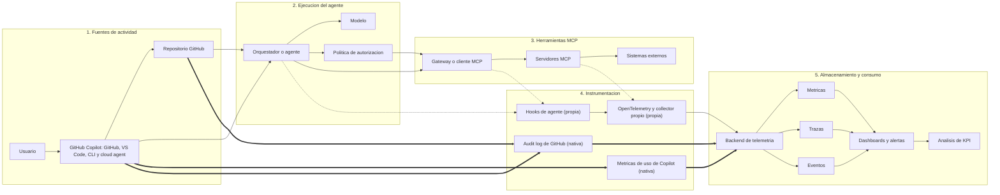

# Diseño de telemetría y KPI para agentes automatizados y utilización de MCP

**Repositorio:** `whsalazar-org/banco-chile-demo`  
**Estado:** Propuesta de diseño  
**Audiencia:** Equipos de producto, plataforma, SRE, seguridad e ingeniería

## 1. Propósito

Este documento define un modelo de telemetría y un marco de KPI para medir:

- La utilización de agentes automatizados.
- El uso de servidores y herramientas MCP.
- La eficiencia, calidad, confiabilidad y costo de los agentes.
- Los resultados para usuarios y negocio, no solo la actividad.

El diseño puede implementarse detrás de un pequeño adaptador de telemetría, sin acoplar la interfaz de usuario a un proveedor específico de observabilidad.

> [“Un SLI es un indicador de nivel de servicio: una medida cuantitativa cuidadosamente definida.”](https://sre.google/sre-book/service-level-objectives/)

## 2. Aplicabilidad a GitHub y GitHub Copilot

La guía es aplicable a GitHub y GitHub Copilot, pero debe implementarse en dos capas:

1. **Telemetría nativa o derivada de GitHub:** adopción, usuarios activos, uso de modos y agentes, generación de código, pull requests, sesiones de agentes y auditoría.
2. **Telemetría propia:** trazas detalladas, llamadas individuales a MCP, latencia, reintentos, validaciones, costo por objetivo y calidad empresarial.

GitHub proporciona métricas de uso de Copilot mediante paneles, API y exportación NDJSON, con datos de adopción, actividad, generación de código y ciclo de vida de pull requests. Estas métricas pueden estar disponibles a nivel empresarial, organizacional, de repositorio y de usuario según el recurso consultado. [La documentación de GitHub describe la API de métricas de uso como la opción recomendada para nuevas integraciones y análisis.](https://docs.github.com/en/copilot/concepts/copilot-usage-metrics/copilot-metrics)

Las métricas nativas deben interpretarse como señales de adopción y actividad, no como una medición completa de la calidad o del valor empresarial. Por ejemplo, las métricas de líneas de código son direccionales y no demuestran por sí solas corrección, mantenibilidad o éxito del usuario. [GitHub define las métricas de líneas de código como una medida direccional de la producción de Copilot.](https://docs.github.com/en/copilot/reference/copilot-usage-metrics/lines-of-code-metrics)

### 2.1 Clasificación de disponibilidad

| Área | Disponibilidad en GitHub/Copilot | Tratamiento recomendado |
|---|---|---|
| Usuarios activos y adopción | Nativa | Usar API, paneles o exportaciones de métricas de Copilot |
| Uso de agent mode y cloud agent | Nativa/parcial | Segmentar por modo, agente, repositorio y período |
| Líneas agregadas/eliminadas | Nativa | Usar únicamente como indicador direccional |
| Pull requests creados, revisados y fusionados | Nativa/derivada | Combinar con checks, revisiones, despliegues y reversas |
| Sesiones de agentes, tokens y duración | Nativa en superficies compatibles | Usar registros de sesión para investigación y auditoría |
| Actividad administrativa y de agentes | Nativa mediante audit log | Correlacionar `agent_session_id` cuando esté disponible |
| Configuración de agentes personalizados y MCP | Nativa para superficies compatibles | Restringir herramientas y registrar cambios de configuración |
| Llamadas MCP individuales, duración y reintentos | No debe asumirse como nativa | Instrumentar el agente, el servidor MCP o una capa de observabilidad propia |
| Trazas OpenTelemetry completas | Depende de la superficie | Confirmar soporte para CLI, IDE, cloud agent y servidores propios antes de diseñar la integración |
| Costo por objetivo exitoso | Derivada/propia | Combinar consumo, precios internos y resultados validados |
| Corrección, seguridad y resultado empresarial | Propia | Medir con pruebas, revisiones, incidentes, correcciones y criterios de aceptación |

Las sesiones de agentes de GitHub permiten revisar progreso, uso de tokens, duración y herramientas utilizadas. [Los registros de sesión también permiten relacionar commits con la sesión que los produjo.](https://docs.github.com/en/copilot/how-tos/copilot-on-github/use-copilot-agents/manage-and-track-agents)

La actividad agentic puede consultarse en el audit log usando filtros como `actor:Copilot`; los eventos pueden incluir `agent_session_id`. [GitHub documenta una ventana de consulta de 180 días para esta actividad en el audit log empresarial.](https://docs.github.com/en/enterprise-cloud%40latest/copilot/reference/agentic-audit-log-events)

### 2.2 Fuentes de datos recomendadas

| Fuente | Uso recomendado |
|---|---|
| API de métricas de uso de Copilot | Adopción, usuarios activos, modelos, modos, agentes y actividad por repositorio |
| Panel de generación de código | Cambios iniciados por usuarios y agentes |
| Panel de impacto de Copilot | Relación entre adopción y resultados de pull requests |
| Registros de sesiones de agentes | Investigación de sesiones, herramientas, tokens y duración |
| Audit log empresarial | Actividad de agentes y eventos administrativos |
| Pull requests, checks y deployments | Validación de calidad, entrega y resultados operativos |
| Hooks de agentes | Eventos de sesión, prompts, llamadas a herramientas y resultados, cuando la política lo permita |
| OpenTelemetry o colector propio | Spans, llamadas MCP, latencia, reintentos, costo y calidad empresarial |

GitHub documenta hooks para cloud agent y Copilot CLI que pueden utilizarse para registrar resultados, estadísticas de uso, auditorías y métricas de rendimiento. [Los hooks deben diseñarse con minimización de datos y controles de privacidad.](https://docs.github.com/en/copilot/concepts/agents/hooks)

## 3. Principios de diseño

1. **Medir primero los resultados.** La actividad del agente no equivale al éxito. Las medidas principales son los objetivos completados, la corrección, la seguridad, la latencia y el costo.
2. **Usar trazas para la causalidad.** Una solicitud de usuario debe producir una traza que contenga los pasos del agente, las llamadas al modelo, las llamadas MCP, los reintentos, las aprobaciones y el resultado final.
3. **Usar métricas para la agregación.** Los contadores, histogramas y medidores deben responder preguntas operativas sin consultar eventos sin procesar.
4. **Usar registros/eventos para la auditabilidad.** Registrar eventos estructurados para investigaciones, reproducción, análisis de calidad y cumplimiento.
5. **Preservar la privacidad.** No emitir por defecto prompts, tokens, números de cuenta, credenciales, cadenas de conexión ni payloads de herramientas. Usar enmascaramiento, hashing, muestreo y controles de acceso.
6. **Controlar la cardinalidad.** Usar dimensiones acotadas como `agent_name`, `agent_version`, `environment`, `mcp_server`, `tool_name`, `outcome` y `error_type`.
7. **Conectar métricas con trazas.** Los exemplars de OpenTelemetry pueden asociar valores métricos con el contexto de una traza, permitiendo pasar de un KPI a una ejecución representativa.
8. **Distinguir disponibilidad de capacidad.** Marcar cada KPI como `github-native`, `github-derived` o `custom-instrumentation`.
9. **Separar éxito técnico de éxito empresarial.** Un commit, pull request o despliegue completado no demuestra por sí solo que se haya satisfecho el objetivo del usuario.

## 4. Modelo de medición

### 4.1 Jerarquía de entidades

```text
Sesión de usuario o tarea de GitHub
└── Ejecución / traza del agente
    ├── Planificación
    ├── Invocación del modelo
    ├── Llamada a herramienta MCP
    │   ├── Solicitud
    │   ├── Autorización / aprobación
    │   └── Resultado o error
    ├── Edición, commit o pull request
    ├── Validación / recuperación
    └── Resultado final
```

### 4.2 Identificadores requeridos

| Identificador | Propósito |
|---|---|
| `trace_id` | Correlaciona una ejecución completa del agente |
| `span_id` | Identifica una operación dentro de una traza |
| `session_id` | Agrupa interacciones de usuario relacionadas |
| `agent_run_id` | Identificador estable de una ejecución del agente |
| `agent_session_id` | Correlaciona actividad agentic de GitHub cuando esté disponible |
| `agent_name` / `agent_version` | Facilita el análisis de despliegues y regresiones |
| `repository` / `pull_request_number` | Relaciona el trabajo con el repositorio y la entrega |
| `mcp_server` / `tool_name` | Identifica la capacidad externa utilizada |
| `policy_decision_id` | Correlaciona una autorización, aprobación o denegación |

Nunca usar identificadores de usuario sin procesar como etiquetas de métricas. Preferir un identificador seudónimo revisado desde el punto de vista de privacidad únicamente en los registros.

## Diagrama de arquitectura de telemetría



Leyenda: las flechas con linea doble (`==>`) representan telemetria nativa o derivada de GitHub; las flechas punteadas (`-.->`) representan telemetria propia que requiere instrumentacion adicional.

GitHub y Copilot aportan de forma nativa o derivada la adopcion, la actividad de agentes, las sesiones, los pull requests y la auditoria, segun la superficie utilizada. En cambio, las llamadas MCP individuales, sus latencias, reintentos, validaciones, costos por objetivo y la calidad empresarial requieren instrumentacion propia cuando no estan expuestas nativamente.

## 5. Señales de telemetría

### 5.1 Trazas

Crear spans para:

- `agent.run`
- `agent.plan`
- `model.invoke`
- `mcp.tool.call`
- `mcp.tool.approval`
- `agent.validation`
- `agent.retry`
- `agent.handoff`
- `agent.commit`
- `agent.pull_request`
- `agent.finalize`

Atributos de span recomendados:

```text
agent.name
agent.version
agent.surface              # github, vscode, cli, cloud-agent
agent.mode                 # interactivo, segundo plano, programado
agent.goal_type
agent.step_index
agent.step_count
repository
pull_request.number
model.provider
model.name
model.requested_output_tokens
model.actual_input_tokens   # solo si está disponible de forma segura
model.actual_output_tokens  # solo si está disponible de forma segura
mcp.server
mcp.tool
mcp.transport
mcp.operation
mcp.approval_required
mcp.approval_result
outcome                     # éxito, fallo, tiempo de espera, denegado, cancelado
error.type
retry.count
```

No almacenar por defecto prompts completos, respuestas completas del modelo ni argumentos MCP en los spans. Si la depuración requiere capturar payloads, usar muestreo explícito con enmascaramiento y retención breve. En exportaciones de telemetría de Copilot, mantener deshabilitada la captura de contenido salvo necesidad explícita, revisión de privacidad y controles de acceso.

### 5.2 Métricas

Usar contadores, histogramas y medidores compatibles con OpenTelemetry. Se prefieren histogramas para distribuciones de latencia, tokens y costos, porque los promedios pueden ocultar el comportamiento de cola.

| Métrica | Tipo | Disponibilidad | Dimensiones sugeridas |
|---|---|---|---|
| `agent_runs_total` | Contador | github-derived/custom | agente, superficie, versión, resultado |
| `agent_run_duration_ms` | Histograma | custom | agente, superficie, resultado |
| `agent_active_runs` | Medidor | github-derived/custom | agente, entorno |
| `agent_success_total` | Contador | custom | agente, tipo de objetivo, tipo de éxito |
| `agent_user_corrections_total` | Contador | custom | agente, tipo de corrección |
| `agent_escalations_total` | Contador | github-derived/custom | agente, motivo |
| `agent_steps_total` | Contador | session/custom | agente, tipo de paso |
| `agent_retries_total` | Contador | custom | agente, motivo del reintento |
| `mcp_calls_total` | Contador | custom | servidor, herramienta, resultado |
| `mcp_call_duration_ms` | Histograma | custom | servidor, herramienta, resultado |
| `mcp_timeouts_total` | Contador | custom | servidor, herramienta |
| `mcp_denials_total` | Contador | github-derived/custom | servidor, herramienta, política |
| `mcp_result_validation_failures_total` | Contador | custom | servidor, herramienta, tipo de validación |
| `model_invocations_total` | Contador | github-derived/custom | modelo, proveedor, resultado |
| `model_tokens_total` | Contador | session/custom | modelo, proveedor, tipo de token |
| `agent_estimated_cost_usd` | Contador | custom | agente, modelo, servidor MCP |
| `agent_quality_score` | Histograma | custom | agente, evaluador, banda de puntuación |
| `copilot_active_users` | Gauge/contador | github-native | período, organización, repositorio |
| `copilot_agent_adoption` | Gauge | github-native | período, organización |
| `copilot_pull_requests` | Contador | github-derived | repositorio, resultado, período |
| `copilot_loc_added_sum` | Contador | github-native | repositorio, agente, lenguaje |

Las métricas de líneas de código deben utilizarse como señales direccionales, no como KPI de calidad aislado. Las métricas de uso de Copilot pueden variar entre paneles, API y exportaciones por sus diferentes agregaciones y modelos de datos.

### 5.3 Eventos estructurados

Emitir eventos estructurados para las transiciones de estado importantes:

```json
{
  "event_name": "mcp.tool.completed",
  "event_version": 1,
  "timestamp": "2026-08-05T00:00:00Z",
  "trace_id": "redacted-or-generated-id",
  "agent_session_id": "github-session-id-if-available",
  "agent_surface": "github-cloud-agent",
  "repository": "whsalazar-org/banco-chile-demo",
  "agent_name": "account-assistant",
  "agent_version": "1.3.0",
  "mcp_server": "customer-data",
  "tool_name": "get_account_summary",
  "duration_ms": 184,
  "outcome": "success",
  "result_size_bytes": 420,
  "redaction_applied": true
}
```

Los eventos deben tener versionado. Los consumidores deben tolerar campos adicionales y conservar los campos desconocidos al reenviarlos.

## 6. Marco de KPI

### 6.1 KPI de utilización

| KPI | Fórmula | Disponibilidad | Interpretación |
|---|---|---|---|
| **Usuarios activos del agente** | Usuarios activos distintos por período | github-native | Adopción y alcance |
| **Ejecuciones del agente** | Cantidad de ejecuciones iniciadas | github-derived/custom | Volumen de demanda |
| **Tasa de finalización** | Ejecuciones completadas / ejecuciones iniciadas | custom | Confiabilidad básica |
| **Utilización recurrente** | Usuarios con 2 o más ejecuciones / usuarios activos | github-derived | Formación de hábito |
| **Utilización de capacidades** | Ejecuciones que usan una capacidad / ejecuciones totales | github-derived/custom | Qué herramientas aportan valor |
| **Concurrencia máxima** | Máximo de ejecuciones simultáneas | custom | Planificación de capacidad |
| **Tasa de derivación humana** | Objetivos elegibles completados sin transferencia humana / objetivos elegibles | custom | Cobertura de automatización |

La utilización debe segmentarse por `goal_type`, recorrido del usuario, superficie y entorno. Un alto número de llamadas o líneas modificadas con baja finalización no representa una utilización saludable.

### 6.2 KPI de llamadas MCP

| KPI | Fórmula | Disponibilidad | Interpretación |
|---|---|---|---|
| **Llamadas por ejecución** | Llamadas MCP / ejecuciones del agente | custom | Dependencia de herramientas y eficiencia del plan |
| **Herramientas únicas por ejecución** | Herramientas distintas / ejecución | custom | Amplitud del flujo de trabajo |
| **Tasa de éxito de herramientas** | Llamadas exitosas / llamadas totales | custom | Confiabilidad de MCP |
| **Tasa de tiempo de espera de herramientas** | Llamadas con tiempo agotado / llamadas totales | custom | Problemas de dependencias o tiempos de espera |
| **Tasa de denegación de herramientas** | Llamadas denegadas por política / llamadas intentadas | github-derived/custom | Fricción de seguridad y autorización |
| **Amplificación por reintentos** | Llamadas totales, incluidos reintentos / llamadas iniciales | custom | Desperdicio causado por reintentos |
| **Proporción de llamadas útiles** | Llamadas que contribuyen a un resultado validado / llamadas totales | custom | Efectividad de la herramienta |
| **Contribución de latencia MCP** | Duración MCP / duración completa de la ejecución | custom | Impacto de la dependencia |
| **Tasa de fallos de validación de resultados** | Resultados inválidos / llamadas completadas | custom | Problemas de contratos y calidad de datos |

La configuración de agentes personalizados de GitHub permite habilitar herramientas MCP específicas. [La documentación de GitHub indica que las herramientas pueden limitarse en el perfil del agente y en la configuración del repositorio.](https://docs.github.com/en/copilot/reference/custom-agents-configuration) Sin embargo, la disponibilidad de la configuración no implica que GitHub exponga todas las métricas operativas de cada llamada; esas métricas deben instrumentarse cuando sean necesarias.

### 6.3 KPI de eficiencia del agente

| KPI | Fórmula | Disponibilidad | Interpretación |
|---|---|---|---|
| **Tasa de éxito del objetivo** | Ejecuciones que cumplen los criterios de aceptación / ejecuciones elegibles | custom | Medida principal de efectividad |
| **Éxito al primer intento** | Ejecuciones exitosas sin reintento, corrección ni transferencia / ejecuciones exitosas | custom | Calidad de planificación y ejecución |
| **Pasos por objetivo exitoso** | Pasos del agente / objetivos exitosos | session/custom | Eficiencia del razonamiento |
| **Tokens por objetivo exitoso** | Tokens / objetivos exitosos | session/custom | Eficiencia del modelo |
| **Costo por objetivo exitoso** | Costo total estimado / objetivos exitosos | custom | Eficiencia económica |
| **Tiempo hasta un resultado útil** | Tiempo hasta el primer resultado útil validado | custom | Velocidad percibida por el usuario |
| **Latencia p95 de extremo a extremo** | Percentil 95 de la duración de la ejecución | custom | Experiencia de usuario en cola |
| **Tasa de recuperación** | Fallos recuperados / fallos recuperables | custom | Resiliencia |
| **Tasa de transferencia humana** | Transferencias / ejecuciones iniciadas | github-derived/custom | Limitaciones de automatización |
| **Tasa de corrección del usuario** | Ejecuciones que requieren corrección / ejecuciones completadas | custom | Brecha de calidad |
| **Tasa de intervención de seguridad** | Acciones riesgosas bloqueadas o escaladas / intentos riesgosos | github-derived/custom | Efectividad de controles |
| **Tasa de pull requests fusionados** | Pull requests fusionados / pull requests creados | github-derived | Entrega técnica, no éxito empresarial |
| **Tiempo hasta merge** | Mediana o p95 desde creación hasta merge | github-derived | Flujo de entrega |

Un menor número de pasos no es automáticamente mejor. Optimizar el **costo y la latencia por objetivo exitoso**, asegurando que la corrección y la seguridad permanezcan por encima de sus SLO. Un pull request fusionado, una alta adopción o muchas líneas modificadas no prueban por sí solos que el objetivo del usuario se haya satisfecho.

### 6.4 Separación de resultados

| Nivel | Ejemplo de evidencia | No debe confundirse con |
|---|---|---|
| **Éxito técnico** | El agente terminó, las herramientas respondieron y los tests pasaron | Valor empresarial |
| **Éxito de entrega** | Se creó y fusionó un pull request o se completó un deployment | Corrección funcional completa |
| **Éxito empresarial** | El objetivo del usuario se satisfizo sin corrección posterior | Actividad o volumen de código |

## 7. SLO y umbrales de alerta recomendados

Los objetivos iniciales deben tratarse como hipótesis y recalibrarse después de obtener datos de referencia.

| SLO / alerta | Objetivo inicial | Fuente |
|---|---:|---|
| Tasa de finalización de ejecuciones | ≥ 99% | custom |
| Tasa de éxito del objetivo | ≥ 95% para tipos de objetivo estables | custom |
| Latencia de extremo a extremo | p95 ≤ 10 segundos para flujos interactivos | custom |
| Tasa de éxito de herramientas MCP | ≥ 99%, excluyendo denegaciones por política | custom |
| Tasa de tiempo de espera MCP | ≤ 1% | custom |
| Éxito al primer intento | ≥ 80% | custom |
| Tasa de transferencia humana | ≤ 15% para flujos elegibles | github-derived/custom |
| Tasa de corrección del usuario | ≤ 10% | custom |
| Eventos de datos sensibles sin enmascarar | 0 | custom/audit |

Usar objetivos separados para flujos interactivos, por lotes y de alto riesgo. Realizar seguimiento de presupuestos de error para los SLO de confiabilidad; la disponibilidad no debe ser la única medida de calidad del agente.

## 8. Diseño de paneles

### Panel ejecutivo

- Usuarios activos y utilización recurrente semanal.
- Adopción de agent mode y cloud agent.
- Tasa de éxito de objetivos y tasa de corrección del usuario.
- Tasa de derivación humana.
- Costo por objetivo exitoso.
- Tiempo p95 hasta un resultado útil.
- Pull requests fusionados y tiempo hasta merge.
- Intervenciones de seguridad e incidentes sin resolver.

### Panel operativo

- Volumen de ejecuciones y concurrencia.
- Tasas de finalización y fallos.
- Latencia p50/p95/p99 del agente.
- Llamadas MCP por servidor/herramienta.
- Tasas de error, tiempo de espera, denegación y reintento de MCP.
- Tendencias de tokens del modelo y costo estimado.
- Principales tipos de error y versiones de agente afectadas.
- Estado de checks, despliegues y reversas relacionados con pull requests de agentes.

### Vista de investigación

- Cascada de trazas para un `agent_run_id`.
- `agent_session_id`, versión del agente y grupo de despliegue.
- Secuencia de llamadas a herramientas y decisiones de política.
- Cadena de reintentos y alternativas.
- Resultados de validación.
- Commits, pull requests, checks y despliegues relacionados.
- Enlaces desde exemplars métricos a trazas representativas.

## 9. Contrato de instrumentación para la demostración React

Agregar una interfaz pequeña e independiente del proveedor, por ejemplo:

```javascript
export function createAgentTelemetry(transport) {
  return {
    startRun(context) {
      return transport.startSpan('agent.run', context);
    },
    recordMcpCall(event) {
      transport.increment('mcp_calls_total', {
        server: event.server,
        tool: event.tool,
        outcome: event.outcome,
      });
    },
    recordOutcome(event) {
      transport.increment('agent_success_total', {
        agent: event.agent,
        goalType: event.goalType,
        successType: event.successType,
      });
    },
  };
}
```

El adaptador de producción podrá exportar datos de OpenTelemetry posteriormente. El adaptador de demostración debe escribir únicamente eventos sanitizados en la consola o en un recolector en memoria. Nunca enviar secretos, credenciales, cadenas de conexión, datos completos de cuentas ni payloads de herramientas sin restricciones desde el navegador.

## 10. Gobierno de datos y seguridad

- Clasificar prompts, salidas, argumentos de herramientas y resultados antes de recopilarlos.
- Usar telemetría basada únicamente en metadatos por defecto.
- Enmascarar datos de pagos, identidad, autenticación y cuentas.
- Aplicar hashing o tokenización a identificadores cuando se requiera correlación.
- Cifrar la telemetría en tránsito y en reposo.
- Restringir las trazas sin procesar a operadores autorizados.
- Definir la retención por señal: retención breve para trazas de depuración con payloads y más prolongada para KPI agregados.
- Auditar el acceso a telemetría sensible.
- Incluir `redaction_applied`, `sampling_rate` y `data_classification` en los metadatos del evento.
- Tratar los eventos de autorización y denegación de herramientas como telemetría de seguridad, no solo como errores de aplicación.
- No incluir secretos en perfiles de agentes ni archivos de configuración MCP.
- Usar secretos y variables de agentes para valores sensibles.
- Aplicar el principio de mínimo privilegio a las herramientas MCP, especialmente a las operaciones de escritura.
- Revisar servidores MCP de terceros antes de habilitarlos.
- Considerar los eventos de audit log de GitHub como una fuente adicional, no como sustituto de la telemetría detallada propia.

## 11. Fases de implementación

### Fase 1: Línea base de GitHub

1. Definir tipos de objetivos y criterios de aceptación.
2. Identificar la superficie: GitHub, VS Code, Copilot CLI o cloud agent.
3. Habilitar la API o exportación de métricas de uso de Copilot.
4. Registrar adopción, usuarios activos, modo de agente, repositorio, pull requests y tiempo hasta merge.
5. Agregar `trace_id`, `agent_run_id`, versión del agente, resultado y duración para la telemetría propia.
6. Construir el panel operativo.

### Fase 2: Eficiencia y calidad

1. Agregar contabilidad de tokens y costos del modelo cuando la superficie lo permita.
2. Agregar reintentos, alternativas, fallos de validación y transferencias humanas.
3. Instrumentar llamadas MCP individuales en el agente o servidor MCP.
4. Agregar éxito al primer intento, costo por objetivo exitoso y KPI de corrección del usuario.
5. Vincular métricas con trazas mediante exemplars.

### Fase 3: Gobierno y optimización

1. Agregar telemetría de decisiones de política y KPI de seguridad.
2. Introducir controles de muestreo y retención.
3. Establecer SLO y presupuestos de error por clase de flujo de trabajo.
4. Integrar audit log, hooks y sesiones de agentes según los permisos y la superficie aplicable.
5. Ejecutar experimentos controlados sobre prompts, modelos, selección de herramientas y estrategias de orquestación.

## 12. Cadencia de revisión operativa

- **Diaria:** confiabilidad, latencia, fallos MCP y alertas de seguridad.
- **Semanal:** utilización, costo por objetivo exitoso, utilidad de herramientas, pull requests y regresiones por versión.
- **Mensual:** adopción, cobertura de automatización, tendencias de calidad, revisión de SLO/presupuesto de error y auditorías de retención/acceso.

## 13. Referencias

1. [Métricas de uso de GitHub Copilot](https://docs.github.com/en/copilot/concepts/copilot-usage-metrics/copilot-metrics) — adopción, actividad, generación de código y pull requests.
2. [Datos disponibles en las métricas de uso de Copilot](https://docs.github.com/en/enterprise-cloud%40latest/copilot/reference/copilot-usage-metrics/copilot-usage-metrics) — campos, agentes, modelos y granularidades.
3. [Métricas de líneas de código](https://docs.github.com/en/copilot/reference/copilot-usage-metrics/lines-of-code-metrics) — interpretación direccional de líneas sugeridas, agregadas y eliminadas.
4. [Administración de sesiones de agentes](https://docs.github.com/en/copilot/how-tos/copilot-on-github/use-copilot-agents/manage-and-track-agents) — progreso, herramientas, tokens, duración y relación con commits.
5. [Eventos de audit log para agentes](https://docs.github.com/en/enterprise-cloud%40latest/copilot/reference/agentic-audit-log-events) — actividad agentic y `agent_session_id`.
6. [Configuración de agentes personalizados](https://docs.github.com/en/copilot/reference/custom-agents-configuration) — herramientas, servidores MCP y secretos.
7. [Hooks para GitHub Copilot](https://docs.github.com/en/copilot/concepts/agents/hooks) — eventos de sesión, llamadas a herramientas y auditoría.
8. [Modelo de datos de métricas de OpenTelemetry](https://opentelemetry.io/docs/specs/otel/metrics/data-model/) — métricas, histogramas y exemplars.
9. [Model Context Protocol: Tools](https://modelcontextprotocol.io/specification/2024-11-05/server/tools) — descubrimiento, invocación, resultados y errores de herramientas.
10. [Google SRE: Objetivos de nivel de servicio](https://sre.google/sre-book/service-level-objectives/) — SLI, SLO, percentiles, corrección y presupuestos de error.
11. [Google SRE: Mejores prácticas de servicios](https://sre.google/sre-book/service-best-practices/) — medición centrada en el usuario y resultados de monitoreo.
12. [Google SRE: Fallos en cascada](https://sre.google/sre-book/addressing-cascading-failures/) — latencia de cola, límites de tiempo, reintentos y agotamiento de recursos.

> El KPI central no es “¿cuántas veces actuó el agente?”, sino “¿con qué confiabilidad, seguridad, rapidez y eficiencia económica completó el agente un objetivo valioso para el usuario?”.
